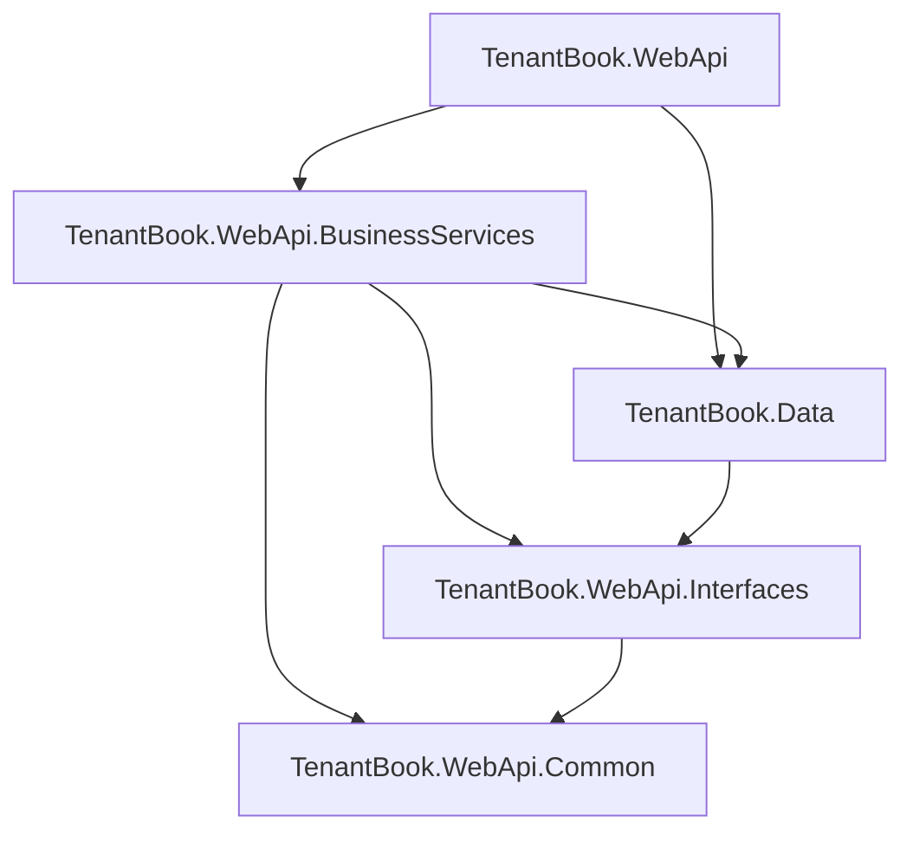

# Architecture

## Solution Structure
The solution contains 5 .NET projects in a layered architecture utilizing interface-based dependency inversion:

1. **TenantBook.WebApi** — ASP.NET Core host with controllers, middleware, and `Program.cs`.
2. **TenantBook.WebApi.BusinessServices** — Service implementations containing core business logic.
3. **TenantBook.WebApi.Interfaces** — Service contracts (interfaces) for dependency inversion.
4. **TenantBook.WebApi.Common** — Shared DTOs, constants, and enums.
5. **TenantBook.Data** — EF Core `DbContext`, entity models, migrations, and repositories.

## Request Pipeline
The HTTP request lifecycle goes through the following middleware in `Program.cs`, in order:
1. `ExceptionMiddleware`
2. `SerilogRequestLogging`
3. HTTPS Redirection
4. Static Files (wwwroot)
5. CORS (`AllowFrontend` policy)
6. `RateLimiter`
7. Authentication
8. Authorization
9. Health Checks
10. Controllers

## Dependency Injection
Domain services and repositories are strictly registered with a Scoped lifetime. Key registrations include:

- **Core/Domain Services**: `ICurrentUserService`, `IPropertyService`, `ITenantService`, `ILeaseService`, `IInvoiceService`, `IMaintenanceService`, `IDashboardService`, `IPdfGenerationService`, `IDocumentService`, `IAnalyticsService`
- **External Services**: `IAuthService` mapped to `SupabaseAuthService` (configured with `AddHttpClient`).
- **Caching**: `AuthIdentityCache` (singleton) caches Supabase UID → local identity resolution for JWT claims enrichment, so authenticated requests don't hit the database per request. `ICacheService` (backed by `IDistributedCache`) provides short-lived response caching (e.g. 60s dashboard stats).
- **Repositories**: Generic `IBaseRepository<T>` mapped to `BaseRepository<T>`, alongside specialized entity repositories like `IPropertyRepository` and `ILandlordRepository`.
- **Database**: `TenantBookDbContext` connecting to PostgreSQL via Npgsql.
- **Infrastructure**: Serilog for structured logging and Rate Limiting configurations.

### Performance Notes (cross-region deployment)
The API and database run in different regions (Render Singapore ↔ Supabase Seoul), so every query round trip costs ~80ms of network latency. Mitigations in place:
- JWT identity resolution cached in memory (`AuthIdentityCache`) — one DB hit per user per 10 minutes instead of per request; invalidated whenever a Supabase UID is linked to a new local record.
- `landlords.auth_provider_uid` and `tenants.auth_provider_uid` indexes.
- Dashboard stats: query count collapsed via conditional aggregation (18 round trips → 11), all `AsNoTracking()`, response cached 60s per landlord. Queries run sequentially — the scoped DbContext is not thread-safe.
- Npgsql `Minimum Pool Size=3` keeps warm connections after idle.

## Layer Responsibilities

- **Controllers**: Responsible for HTTP routing, request validation, delegation to business services, and logging.
- **Business Services**: Enforce business logic, map between Domain Entities and DTOs, and handle domain-specific exceptions. Includes the Notification Service (`INotificationService` / `IEmailProvider`) for handling automated email reminders via SMTP.
- **Repositories**: Handle data access using a base `BaseRepository<T>` implementation along with specialized repos. Queries are automatically isolated by global filters.
- **DbContext**: Configures EF Core. Handles global query filters for multi-tenancy, soft delete logic (`IsDeleted`), automatic stamping of `LandlordId` on creation, and converting entity properties to Postgres `snake_case` conventions.

## Error Handling
Global error handling is centralized in `ExceptionMiddleware.cs`. It maps domain and database exceptions into predictable HTTP responses:
- **Postgres 23505 (Unique Violation)**: Returns `400 Bad Request`. Specifically handles cases like duplicate tenant phone numbers.
- **`InvalidOperationException` / `ArgumentException`**: Returns `400 Bad Request`.
- **Other Unhandled Exceptions**: Defaults to `500 Internal Server Error`.

## Frontend Integration
The frontend is built using React 19 with Vite, TypeScript, Axios, and Recharts.
- **Communication**: Interacts with the backend via REST.
- **Authentication**: Utilizes Supabase Auth with JWKS-based JWT validation. The token is passed via the `Authorization` header. The backend intercepts the token and enriches the claims identity with internal system IDs (`landlord_id` or `tenant_id`) based on the unique Supabase `sub` claim.

## Notification Engine (Email, SMS, WhatsApp)

TenantBook utilizes an extensible Notification Engine designed around the **Strategy Pattern** to handle asynchronous communications (Invoices, Welcome Emails, Maintenance Updates).

### Structure
- **`INotificationService`**: The high-level business orchestrator. It exposes strongly-typed domain methods like `SendInvoiceNotificationAsync(tenant, invoice, pdf)`.
- **`IEmailProvider`**: The low-level transport interface.
- **`SmtpEmailProvider`**: An implementation of `IEmailProvider` using `MailKit`.

### Robustness & Logging
Network connections to SMTP servers are notoriously fragile. The `SmtpEmailProvider` is hardened with:
- **Exponential Backoff & Retries**: Automatically retries sending 3 times with increasing delays if the SMTP server drops the connection.
- **Rich Structured Logging**: Tracks exact attempt numbers, subjects, and reasons for failure through Serilog.
