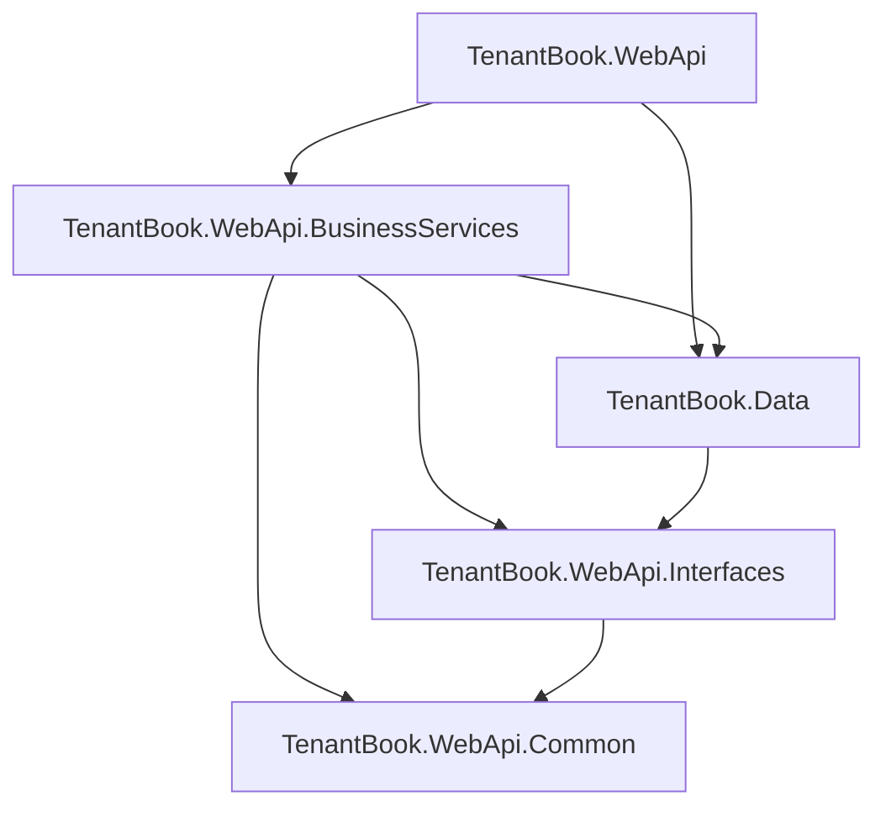

# Architecture

## Solution Structure
The system is divided into a 5-project layered architecture, strongly adhering to Clean Architecture principles and interface-based dependency inversion to decouple domain logic from infrastructure concerns:

1. **TenantBook.WebApi** — ASP.NET Core host containing HTTP controllers, global middleware, and request pipeline configurations.
2. **TenantBook.WebApi.BusinessServices** — Core domain logic, service implementations, and state management.
3. **TenantBook.WebApi.Interfaces** — Service contracts ensuring strict decoupling between the web layer, business logic, and data access.
4. **TenantBook.WebApi.Common** — Shared DTOs, application constants, and domain enums.
5. **TenantBook.Data** — Persistence layer encapsulating the EF Core `DbContext`, entity definitions, migrations, and generic/specialized repositories.

## Request Pipeline
The HTTP lifecycle is strictly governed by a sequence of highly optimized middleware configured in `Program.cs`:
1. `ExceptionMiddleware` (Global Domain Exception Mapping)
2. `SerilogRequestLogging` (Structured telemetry)
3. HTTPS Redirection & Static Files (wwwroot)
4. CORS (`AllowFrontend` policy strictly binding allowed origins)
5. `RateLimiter` (Protecting against abuse)
6. Authentication & Authorization (JWKS validation & Role Claims)
7. Health Checks
8. Endpoint Routing (Controllers)

## Dependency Injection
The IoC container manages domain services and repositories utilizing Scoped lifetimes to guarantee DbContext isolation per HTTP request:

- **Domain Services**: `ICurrentUserService`, `ILeaseService`, `IInvoiceService`, `IPdfGenerationService`, `IDashboardService`, etc.
- **Identity Resolution**: `IAuthService` mapped to an underlying `SupabaseAuthService` using an optimized `AddHttpClient` factory. 
- **Caching Mechanisms**: `AuthIdentityCache` (Singleton) prevents database hammering by caching Supabase UID → local entity resolution for 10 minutes. This drastically reduces DB overhead per authenticated request. `ICacheService` (backed by `IDistributedCache`) serves transient reads (e.g., aggregating dashboard statistics).
- **Persistence**: Generic `IBaseRepository<T>` and specialized repositories abstract EF Core from the business layer.
- **Database**: `TenantBookDbContext` connecting to PostgreSQL via Npgsql.

### Performance Notes (Cross-Region Tuning)
The API and database currently run in distinct regions (Render Singapore ↔ Supabase Seoul), inherently creating ~80ms of network latency per query. To mitigate latency, the backend employs:
- **Aggressive Identity Caching**: Identity resolution is kept in memory. The system makes one DB hit per user per 10 minutes instead of intercepting every request.
- **Strategic Indexing**: Highly-queried lookup columns (`auth_provider_uid` on both Landlords and Tenants) are explicitly indexed.
- **Query Collapsing**: Complex dashboard aggregations were optimized using conditional aggregation, dropping 18 sequential round trips down to just 11. All heavy read queries explicitly use `.AsNoTracking()` to bypass EF Core's change tracker overhead.
- **Connection Pooling**: Npgsql is tuned with `Minimum Pool Size=3` to retain warm connections and bypass TCP handshake delays during idle periods.

## Layer Responsibilities

- **Controllers**: Thin wrappers responsible purely for HTTP routing, request payload validation, and delegation to the Business Services layer.
- **Business Services**: The heart of the application. Enforces domain rules, maps Entities to DTOs, manages transactions, and deliberately throws specific custom Service Exceptions on business rule violations.
- **Repositories**: Isolates EF Core syntax from the service layer. Employs global query filters to silently enforce multi-tenancy rules and soft-delete (`IsDeleted`) logic.
- **DbContext**: Configures EF Core's Fluent API. Automatically injects standard audit trails (CreatedAt, UpdatedAt) and multi-tenant keys (`LandlordId`) transparently during `SaveChanges()`.

## Error Handling
The application completely abstracts stack traces and framework errors from the client. Global error handling is centralized in `ExceptionMiddleware.cs`, which intercepts and maps exceptions to semantic HTTP responses:

- **Custom Service/Domain Exceptions**: The business layer explicitly throws custom exceptions (e.g., `ValidationException`, `NotFoundException`, `ConflictException`, `BusinessRuleViolationException`). The middleware maps these directly to `400 Bad Request`, `404 Not Found`, or `422 Unprocessable Entity`—keeping domain logic entirely separate from HTTP concerns.
- **Postgres 23505 (Unique Violation)**: DbUpdateExceptions are intercepted. Unique constraint violations (e.g., duplicate tenant phone numbers or emails) are elegantly mapped to a `409 Conflict` or descriptive `400 Bad Request`.
- **Unhandled Exceptions**: Any unexpected faults default to a sanitized `500 Internal Server Error`, while the full exception and stack trace are securely logged to Serilog for debugging.

## Notification Engine (Transactional Emails)

TenantBook utilizes an extensible, decoupled Notification Engine designed around the **Strategy Pattern** to handle asynchronous communications such as Rent Invoices and Welcome Emails.

### Structure
- **`INotificationService`**: The business orchestrator. It exposes strongly-typed domain methods (e.g., `SendRentReminderNotificationAsync(tenant, invoice)`) without needing to know *how* the message is sent.
- **`IEmailProvider`**: The transport contract.
- **`BrevoEmailProvider`**: An implementation of `IEmailProvider` that integrates with the **Brevo (formerly Sendinblue) transactional API**. 

### API Integration & Robustness
Because network integrations are inherently fragile, the API-driven `BrevoEmailProvider` is hardened with:
- **Resilience Policies**: Configured with transient fault handling (exponential backoff) via HTTP client policies to ensure emails are eventually delivered even if the third-party API hiccups.
- **Structured Telemetry**: Every email dispatch is securely tracked in Serilog, capturing exact attempt metadata and graceful degradation paths upon failure.
