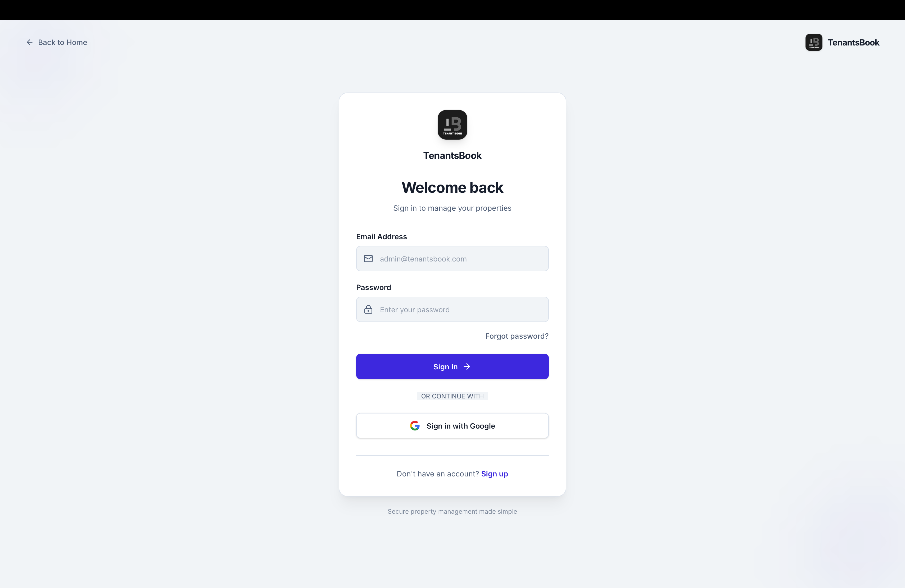
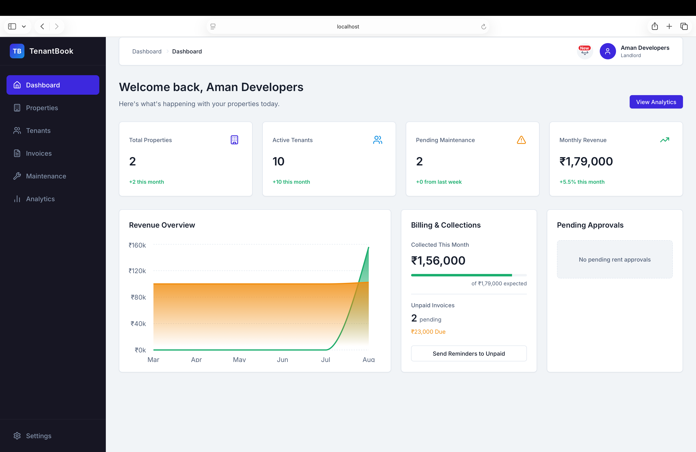
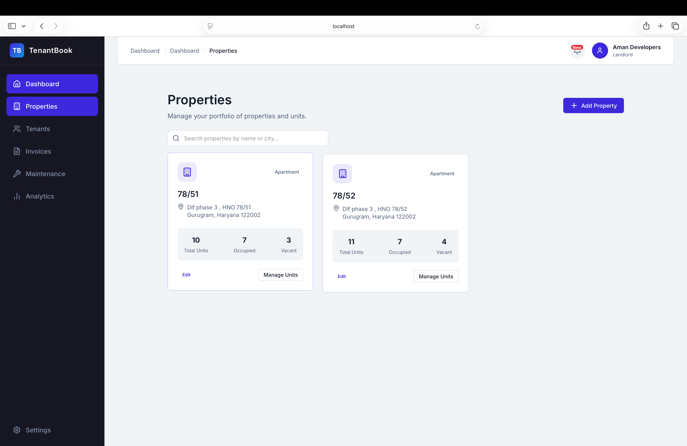
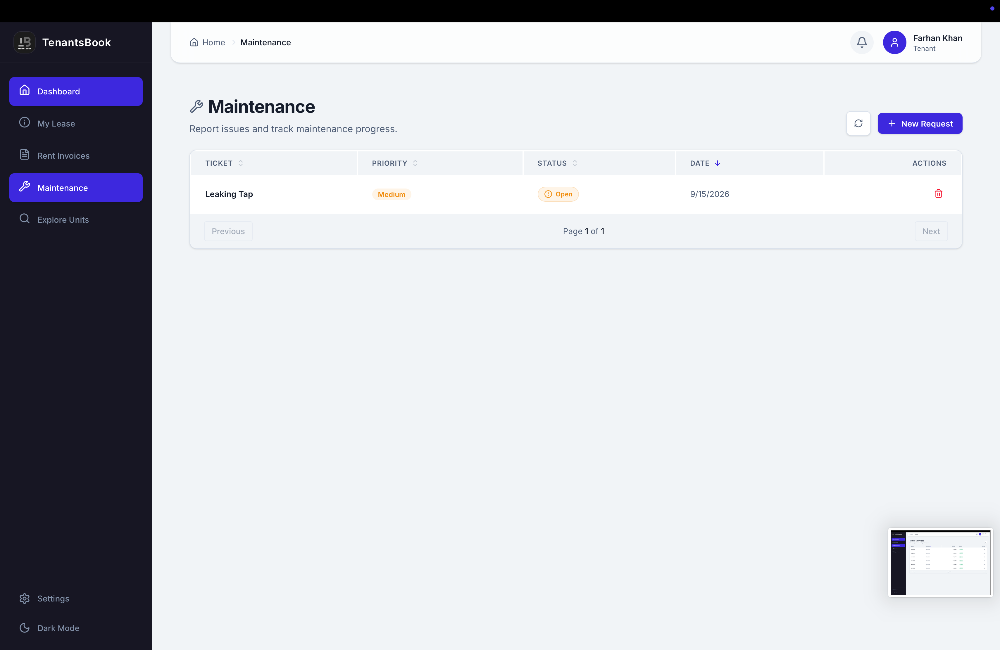
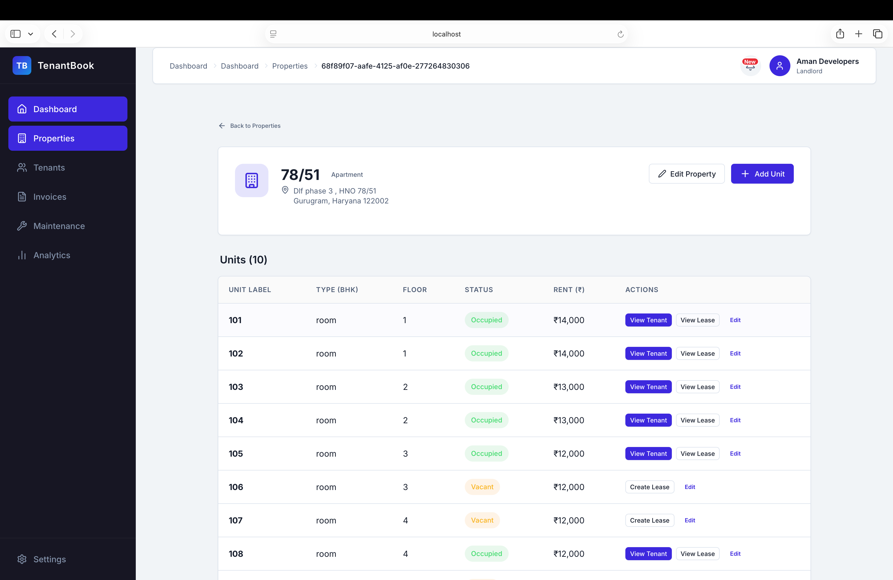
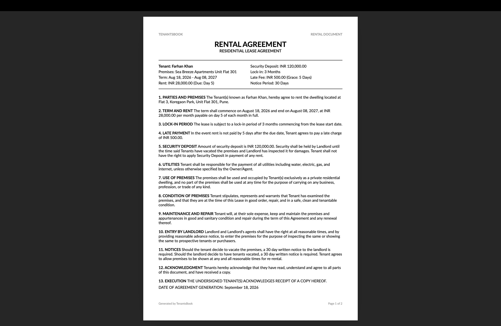

<h1 align="center">
   
  TenantsBook
   
</h1>

<h4 align="center">A comprehensive Full-Stack SaaS platform for modern property management.</h4>

  <a href="#overview">Overview</a> •
  <a href="#key-features">Key Features</a> •
  <a href="#tech-stack">Tech Stack</a> •
  <a href="#architecture">Architecture</a> •
  <a href="#screenshots">Screenshots</a>

---

## 🔗 Live Demo
**Website:** [https://tenantsbook.in/](https://tenantsbook.in/)

*(Note: If testing, please be respectful of the demo environment.)*

## Overview

**TenantsBook** is a professional, end-to-end property management system designed to streamline the rental experience for both landlords and tenants. It replaces scattered spreadsheets and informal communication with a centralized dashboard for lease tracking, automated financial invoicing, and maintenance requests.

> **Note:** This repository is a public showcase / demo repository. The source code for the proprietary backend and frontend is maintained in private repositories. 

## Key Features

- **Role-Based Portals:** Dedicated experiences for Landlords and Tenants with strict row-level security and access control.
- **Property & Unit Management:** Track portfolios, unit occupancy, and listing inquiries in real-time.
- **Automated Financials:** Generate legally-structured Lease Agreements and automated monthly Rent Invoices in professional PDF formats.
- **Maintenance Tracking:** Tenants can raise maintenance tickets; landlords can assign, track, and close them with full state management.
- **Analytics Dashboard:** Visual insights into monthly revenue, pending payments, occupancy rates, and expense tracking.
- **Document Management:** Secure cloud storage integration for lease documents, KYC proofs, and property images.

## Tech Stack

### Frontend
- **Framework:** React 19 + Vite
- **Language:** TypeScript
- **State & UI:** Modern React Patterns, Custom UI components, and Responsive Design
- **Hosting:** Cloudflare Pages

### Backend
- **Framework:** .NET 10 Web API (C#)
- **ORM:** Entity Framework Core
- **Database:** PostgreSQL
- **PDF Generation:** QuestPDF (for Pixel-perfect Agreements and Invoices)
- **Architecture:** Clean Architecture with Repository Pattern

## Architecture
Curious about how the backend is structured? Read the detailed [Architecture Documentation](./ARCHITECTURE.md) covering Dependency Injection, Layer Responsibilities, and our custom cross-region Performance Notes.

---

## Screenshots

<b>Click to expand and view application screenshots</b>

 

*(Note: Below are a few select screens from the application)*

### Landlord Dashboard

### Properties Overview

### Unit Details

### Lease Management

### Automated Invoicing

### Maintenance Tickets

---

## Contact
**Developer:** Shawez  
**Email:** shawez.dev@gmail.com  
**LinkedIn / GitHub:** Feel free to reach out via email for access to the complete source code or to discuss the architecture in depth!

  <i>Developed with ❤️ for modern property management.</i>

